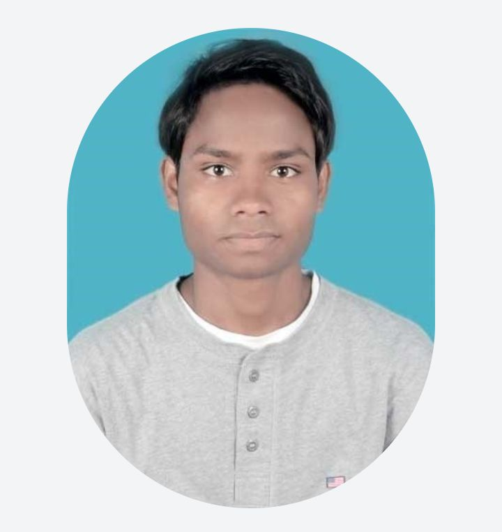

<!-- Profile README | @rammurmu | AI x Modern Tech x UI/UX -->

<div align="center">

  <!-- Modern Animated Banner -->
  

  <br/>
  
  <h1>Hi, I'm <span style="color:#2E9AFE;">Ram Murmu</span> 👋</h1>

  <p>
    <b>Full Stack AI Engineer</b> • <b>Product Designer</b> <br/>
    <b>Founder & CEO</b> @ <a href="https://www.runash.in" target="_blank"><b>RunAsh AI</b></a>
  </p>

  <p>
    
    
    
    
  </p>

  <p>
    <a href="https://rammurmu.com" target="_blank"></a>
    <a href="https://huggingface.co/RamMurmu"></a>
    <a href="https://www.kaggle.com/rammurmu"></a>
    <a href="https://x.com/rammurmuu"></a>
    <a href="https://linkedin.com/in/rammurmu"></a>
    <a href="mailto:rammurmu@outlook.in"></a>
  </p>
  
  <div align="center">
    
  </div>
</div>

---

## ⚡ About Me

```yaml
Name: Ram Murmu
Title: AI Innovator | Full Stack AI Developer | Product Designer
Location: 🌎 Global (MIT, USA)
Interests: LLMs, AI UI, Live Streaming, Human-Centric AI, Open Source
```

> 🚀 Building at the intersection of **AI** and **Modern User Experience**.
>
> 🎨 Designing intelligent, delightful, and accessible AI interfaces for real-world impact.

---

## 🧑‍💻 Modern Tech Stack

<p align="center">
  
</p>

- **Languages:** Python, TypeScript, JavaScript
- **Frameworks:** React, Next.js, FastAPI, Node.js
- **AI/ML:** PyTorch, TensorFlow, Transformers, Scikit-learn, OpenCV
- **Cloud:** AWS, Vercel, Docker
- **UI/UX:** Figma, TailwindCSS, Framer Motion

---

## 🧠 AI Models & Datasets

<table>
  <tr>
    <th>Model</th>
    <th>Description</th>
    <th>Links</th>
  </tr>
  <tr>
    <td><b>RunAsh Language Model (RALM)</b></td>
    <td>Cutting-edge LLM for live streaming chatbots<br/>Fine-tuned on custom datasets</td>
    <td>
      <a href="https://huggingface.co/RamMurmu/RunAsh-Language-Model">Model Card</a>
    </td>
  </tr>
  <tr>
    <td><b>Computer Vision for Live Streaming</b></td>
    <td>Object detection for real-time interactions</td>
    <td>-</td>
  </tr>
  <tr>
    <td><b>Live Streaming Chat Dataset (LSCD)</b></td>
    <td>10,000+ annotated samples for conversational AI</td>
    <td>
      <a href="https://huggingface.co/datasets/RamMurmu/Live-Streaming-Chat-Dataset">Dataset Card</a>
    </td>
  </tr>
</table>

---

## 🏆 Badges & Communities

-  Hugging Face Ambassador
-  Transformers Mastery
-  AI for Social Good
-  Open Source Advocate

---

## 🌱 Projects & Open Source

| Project | Description | Tech |
|---------|-------------|------|
| [RunAsh AI](https://www.runash.in) | AI-powered live streaming platform | LLMs, CV, Next.js, PyTorch |
| [RunAsh Chat](https://runash.in/live/ai) | Conversational AI for live streaming | React, Transformers |
| [Sentiment Behaviour Support Bot](https://github.com/rammurmu/runash-mcp-chat) | AI chatbot for mental health & support | Python, FastAPI |

---

## 🎨 AI UI/UX – The Modern Experience

> **My focus:** Not just powerful AI, but intuitive, aesthetic, and accessible AI **interfaces**.

- 🌈 **Modern UI:** Clean, animated, responsive (TailwindCSS, Framer Motion, Figma)
- 🤝 **Human-Centered:** Empathetic conversational design
- ⚡ **Realtime:** Live AI interactions, streaming data
- 🔓 **Open Source:** Community-driven design, contributions welcome!

<div align="center">
  
</div>

---

## 📈 Stats

<p align="center">
  
  
</p>

---

## 📬 Let's Connect

- [Portfolio Website](https://rammurmu.com)
- [Hugging Face](https://huggingface.co/rammurmu)
- [LinkedIn](https://linkedin.com/in/rammurmu)
- [X (Twitter)](https://x.com/rammurmuu)
- [Kaggle](https://www.kaggle.com/rammurmu)
- **Email**: [rammurmu@outlook.in](mailto:rammurmu@outlook.in)

---

## 🌏 Open for Collaboration

> Let’s build the next generation of **AI-powered user experiences**!
> - DM me for open source projects, research, or startup collaborations.

---

## 📝 License

[](https://choosealicense.com/licenses/mit/)

---

<details>
  <summary>More About Me</summary>

  - 🌟 Currently at MIT, accelerated by Y Combinator, building for the future of live, interactive AI.
  - 🏅 Kaggle Competitor, Hugging Face model author, open source enthusiast.
  - 💬 Ask me about LLMs, conversational AI, modern UI/UX, startup journeys, or anything AI!

  <br>
  
</details>

<!---
  README built with ❤️ by @rammurmu | RunAsh AI
  This profile README ✨ appears on your GitHub profile!
--->
